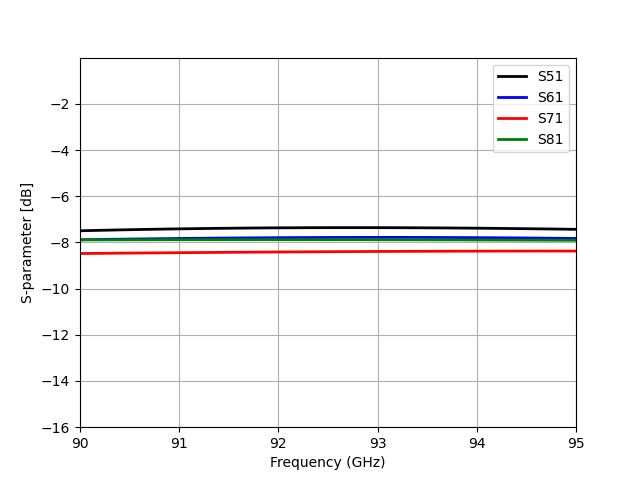
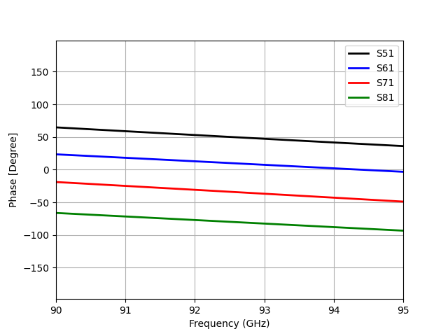

Design data and design process description
############################################

S-parameters in dB:

Phase in degrees:

The above figures present the output characteristics of the proposed
BM-IC for the excited beam (input) port 1.