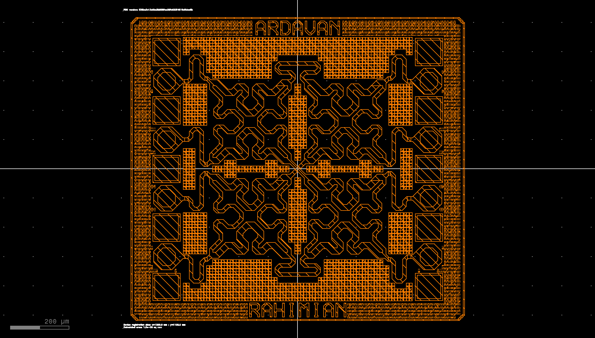

Design of a W-Band Butler Matrix IC
###################################

This work presents the design and performance analysis of a W-band 4×4 Butler Matrix (BM) beamformer, realized as an integrated circuit (IC). The proposed BM operates at 93 GHz and can be deployed in a range of phased-array and electronic beam-steering applications. The IC measures 1.2 mm × 1.1 mm, including the pads. The developed BM-IC is the first of its kind in this form, featuring a novel Branch-Line Coupler (BLC) design and an overall multilayer structure.

